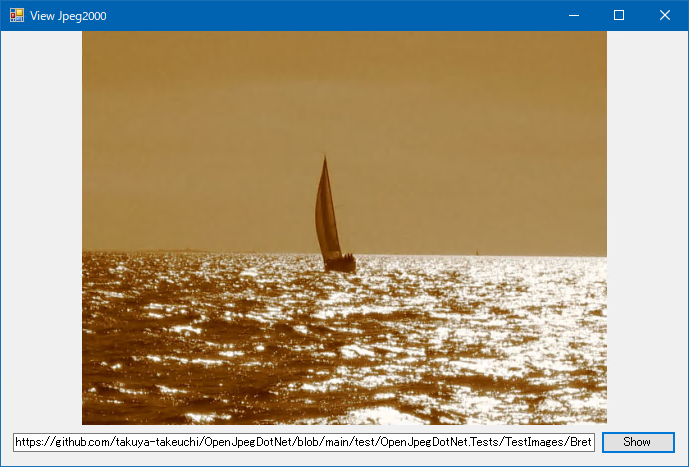

# WinForms ViewJpeg2000
  
This program is demo program to covnert jpeg2000 images to bitmap in WinForms.
 
## How to use? 
 
## 1. Build 
 
1. Open solution file by Visual Studio with WinForms.
1. Restore nuget package
1. Build
 
## 2. Run 

You can build and run from `Visual Studio`.
You can choose a image file to detect objects.

