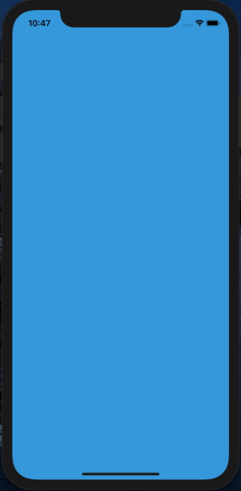

# Xamarin.ViewJpeg2000
  
This program is ported by C# from examples/yolov3.cpp and works on Xamarin. 
 
## How to use? 
 
## 1. Build 
 
1. Open solution file by Visual Studio with Xamarin.
1. Restore nuget package
1. Buuild
 
## 2. Run 

You can build and run from `Visual Studio for Mac`
You can choose a image file to detect objects.

 

