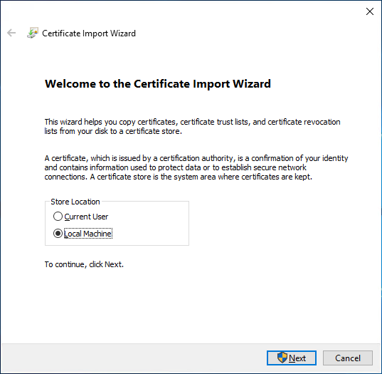
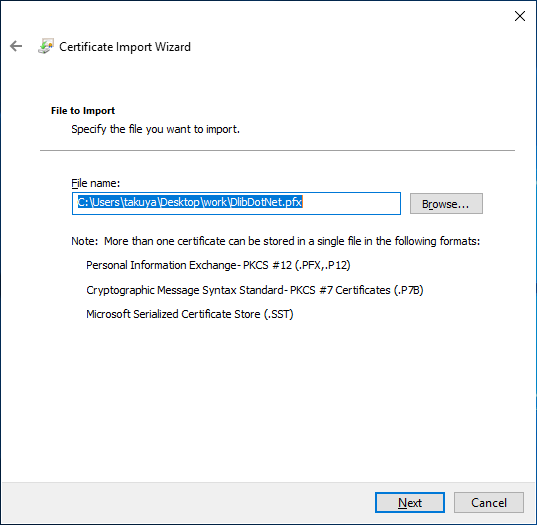
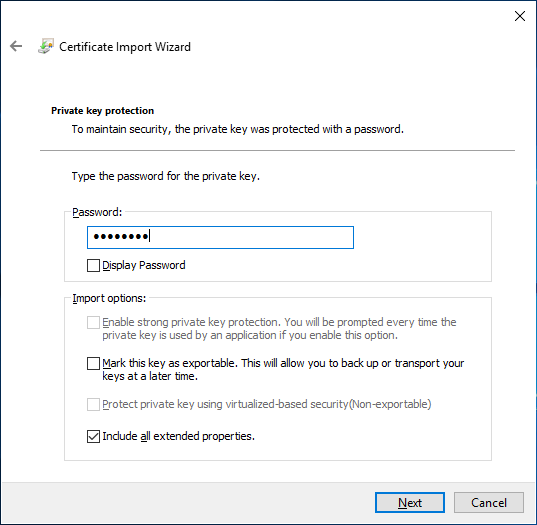
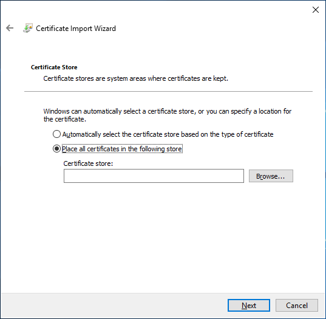
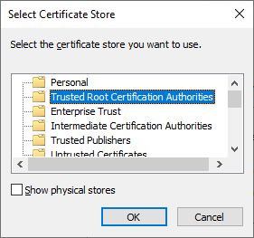
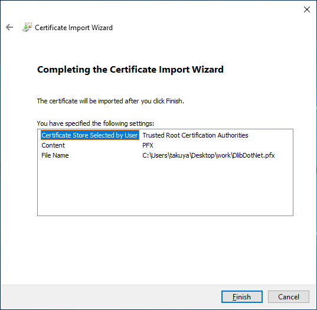
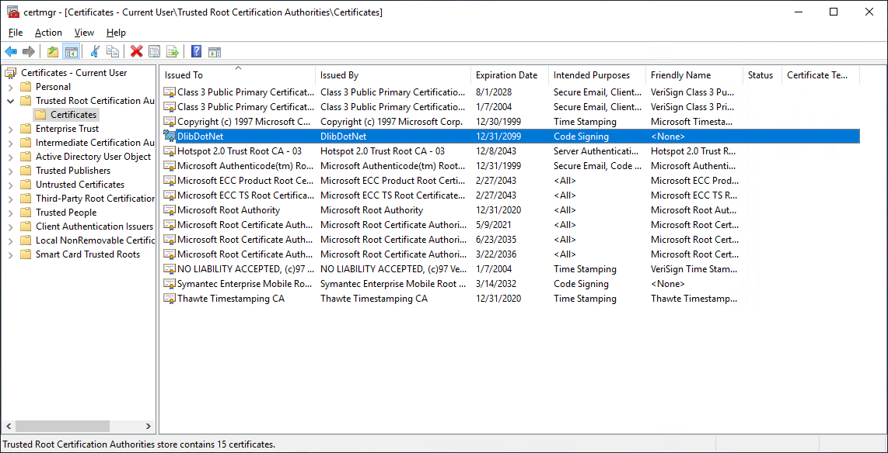
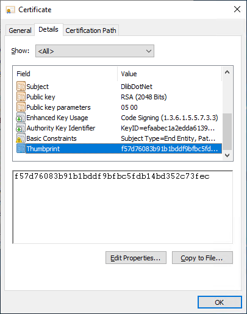

# OpenJpegDotNet.UWP.Tests

This project aims to test whether OpenJpegDotNet.UWP can pass for **Windows App Certification Kit**.

## 1. Create certifications

This project already contains the following files

* OpenJpegDotNet.cer
* OpenJpegDotNet.pvk
* OpenJpegDotNet.pfx

These files are for demonstration.

### Create Self-signed certificate (*.cer)

Specify **password** as password.  
**-eku** must be spefieid.

````bat
> set makecert="C:\Program Files (x86)\Windows Kits\10\bin\x64\makecert.exe"
> %makecert% -n "CN=OpenJpegDotNet" -a sha256 -b 01/01/2000 -e 01/01/2100 -eku 1.3.6.1.5.5.7.3.3 -cy end -r -sv OpenJpegDotNet.pvk OpenJpegDotNet.cer
Succeeded
````

### Create *.pfx

Specify **password** as password of pfx.

````bat
> set pvk2pfx="C:\Program Files (x86)\Windows Kits\10\bin\x64\pvk2pfx.exe"
> %pvk2pfx% -pvk OpenJpegDotNet.pvk -spc OpenJpegDotNet.cer -pfx OpenJpegDotNet.pfx -pi password
````

### Add *.pfx file to system

1. Double click *OpenJpegDotNet.pfx*



2. Select **Local Computer** and click **Next**



3. Click **Next***



4. Input password that is used on execute pvk2pfx
5. Click **Next**



6. Select **Place all certificates in the following store** and select **Browse**



7. Select **Trusted Root Certification Authorities** and click **OK**
8. Click **Next**



9. Click **Finish**

### Check install result of *pfx

1. Run **certmgr.msc**



2. Select **Trusted Root Certification Authorities** and **Certificates**
3. You can see and double click **OpenJpegDotNet** 



4. Move to **Details** tag and copy **Thumbprint** to clipboard

## 2. Build Application 

You must create **OpenJpegDotNet.UWP.nupkg** in nuget directory before build.

### Build

Specify copied **thumbprint** for **/p:PackageCertificateThumbprint**

````bat
> cd OpenJpegDotNet
> set rootOpenJpegDotNet=%cd%
> cd test\OpenJpegDotNet.UWP.Tests
> set OutputDir=Package
> set msbuild="C:\Program Files (x86)\Microsoft Visual Studio\2017\Community\MSBuild\15.0\Bin\amd64\MSBuild.exe"
> if exist Package rmdir %OutputDir% /s /q
> %msbuild% OpenJpegDotNet.UWP.Tests.csproj ^
            /t:restore ^
            /t:Rebuild ^
            /p:RestoreAdditionalProjectSources=%rootOpenJpegDotNet%\nuget ^
            /p:RestoreNoCache=true ^
            /p:Configuration=Release ^
            /p:Platform="x64" ^
            /p:OutDir=%OutputDir% ^
            /p:AppxBundle=Always ^
            /p:AppxBundlePlatforms="x64" ^
            /p:AppxPackageSigningEnabled=true ^
            /p:PackageCertificateThumbprint=f57d76083b91b1bddf9bfbc5fdb14bd352c73fec ^
            /p:PackageCertificateKeyFile="OpenJpegDotNet.pfx"
````

### Sign appx

Specify **password** as pfx password for **/p**.  
Basically, this pfx must not be test certifications but formal certifications.

````bat
> cd OpenJpegDotNet.UWP.Tests
> set OutputDir=Package
> set signtool="C:\Program Files (x86)\Windows Kits\10\bin\x64\signtool.exe"
> %signtool% sign /a /fd SHA256 /f OpenJpegDotNet.pfx /p password %OutputDir%\OpenJpegDotNet.UWP.Tests\OpenJpegDotNet.UWP.Tests_1.0.0.0_x64.appx
Done Adding Additional Store
Successfully signed: Package\OpenJpegDotNet.UWP.Tests\OpenJpegDotNet.UWP.Tests_1.0.0.0_x64.appx
````

## 3. Start Windows App Certification Kit

````bat
> cd OpenJpegDotNet.UWP.Tests
> set rootUWPTest=%cd%
> set appcert="C:\Program Files (x86)\Windows Kits\10\App Certification Kit\appcert.exe"
> set appx="%rootUWPTest%\Package\OpenJpegDotNet.UWP.Tests\OpenJpegDotNet.UWP.Tests_1.0.0.0_x64.appx"
> set report="%rootUWPTest%\Package\OpenJpegDotNet.UWP.Tests\AppCertReport.xml"
> if exist %report% del %report%
> %appcert% test -appxpackagepath %appx%  -reportoutputpath %report%
````